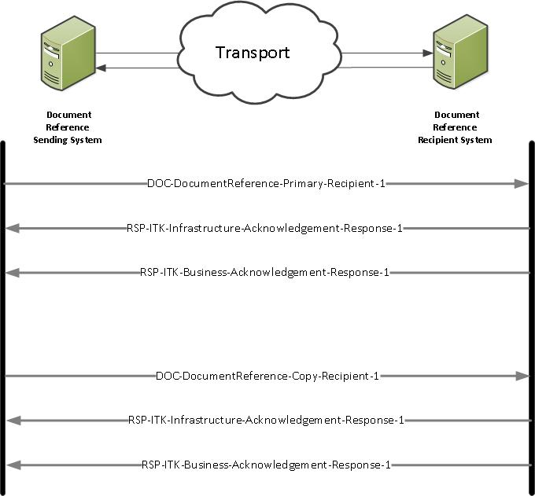

## FHIR Document Architecture ##

**Document Reference Interactions**

This section provides implementers with the information required to utilise the Document Reference Domain Message Specification.

All the profiles for the FHIR interface are based on the HL7 [FHIR DSTU2] 1.0.2 Messaging Implementation (Oct 2015) Messaging Implementation and support multiple interactions. 

Note 1: When using MESH, additional MESH acknowledgements and responses will be available.The MESH acknowledgements and responses not defined in this specification.

Note 2: Further information regarding the ITK FHIR acknowledgements which may be used with these interactions is available in the ITK FHIR Bundle specification.  

----------

**DOC-DocumentReference-Primary-Recipient-1 Interaction** 

The sending system will construct a Document Reference FHIR Document and send it to the primary recipient's receiving system.

- *Sender:* Document Reference Sending system
- *Receiver:*  Document Reference Recipient system
- *Message: Wire Format:* [DocumentReference-1]

----------

**DOC-DocumentReference-Copy-Recipient-1 Interaction** 

The sending system will construct a Document Reference FHIR Document and send it to the copy recipient's receiving system.

- *Sender:*  Document Reference Sending system
- *Receiver:*  Document Reference Recipient system
- *Message: Wire Format:* [DocumentReference-1]

**Acknowledgements Interactions**

Dependent on system set up the following interactions may be utilised.

- RSP-ITK-Infrastructure-Acknowledgement-Response-1
- RSP-ITK-Business-Acknowledgement-Response-1

----------

**Document Reference FHIR Document Interactions Diagram**
 

The diagram shows the Document Reference Interactions:

 

  
 

----------

[DocumentReference-1]: ../Profile.DocumentReference/Profile.DocumentReference.html

[FHIR DSTU2]: http://hl7.org/fhir/DSTU2/documents.html
